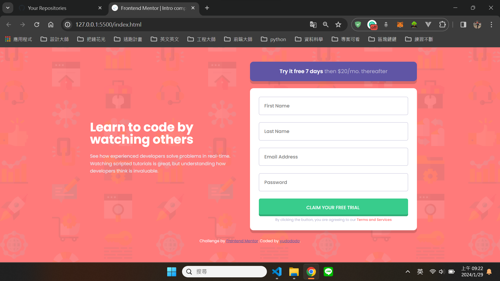
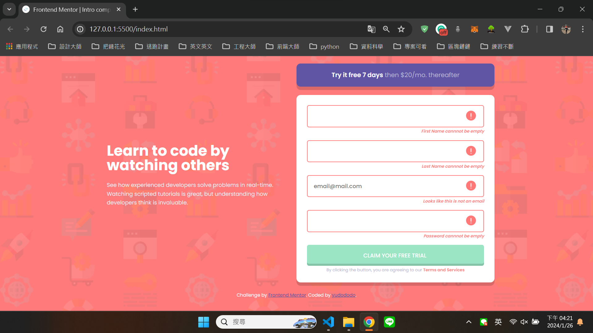
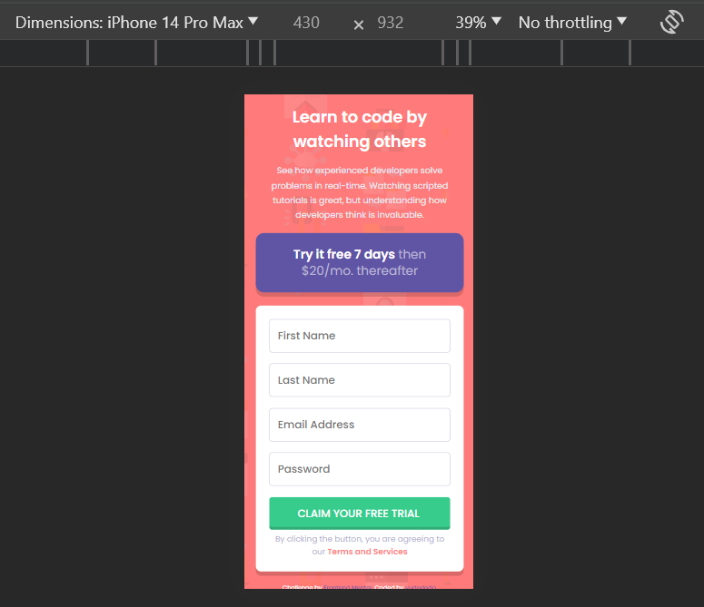
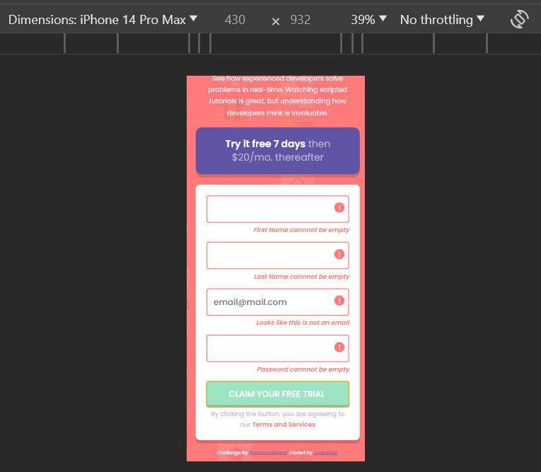

## Overview👀

Hello visitors, I created this github repo to help me practice and showcase my not so refined html, css and JS skill.
Hope that you get a grasp of my current front end skills and help me improve what I lack by sending feedbacks.🙏🙏🙏 

## Screenshot🐻💥

## The challenge🔥

Users should be able to:

- View the optimal layout for the site depending on their device's screen size
- See hover states for all interactive elements on the page
- Receive an error message when the `form` is submitted if:
  - Any `input` field is empty. The message for this error should say *"[Field Name] cannot be empty"*
  - The email address is not formatted correctly (i.e. a correct email address should have this structure: `name@host.tld`). The message for this error should say *"Looks like this is not an email"*

## What I learned💪

Learn to create a form with HTML, CSS and JS

## Author🐶

- Frontend Mentor - [@yudododo](https://www.frontendmentor.io/profile/yudododo)
- Instagram - [@yu_dododo](https://www.instagram.com/yu_dododo/)
